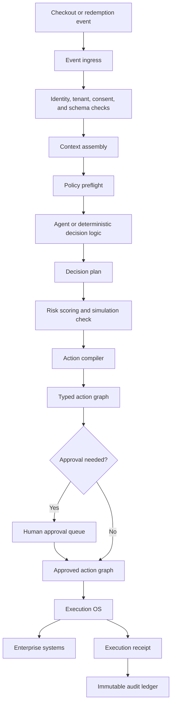

# Nuvia

Repository: https://github.com/ashwanth-art/Nuvia

Nuvia in one word: **Orchestrator**.

Nuvia is an enterprise AI decision orchestration system. It helps companies notice important business events, understand the context, check business rules, prepare a safe decision, execute approved actions, and keep a full audit trail.

## Purpose

Large companies already have many systems: POS, ecommerce, loyalty, CRM, fraud, marketing, inventory, finance, and data warehouse. These systems create many events every second, but decisions are often slow, manual, disconnected, or hard to audit.

Nuvia sits between these systems as a governed decision layer.

In simple terms, Nuvia answers:

- What happened?
- Who or what is affected?
- What rules apply?
- What should we do?
- Is human approval needed?
- Which system should receive the action?
- Why was this decision made?

## First Product Focus

The first version of Nuvia should focus on:

**Real-time loyalty offer and fraud-safe redemption governance for enterprise retail checkout.**

Example:

1. A customer checks out in store or online.
2. POS or ecommerce sends the event to Nuvia.
3. Nuvia collects customer, basket, loyalty, margin, consent, and fraud context.
4. Nuvia checks policies.
5. Nuvia recommends or prepares an action.
6. Low-risk actions can execute automatically.
7. High-risk actions go to human approval.
8. Every decision is recorded for audit.

## Local MVP Code

This repository now includes the local Nuvia MVP. The core decision pipeline has dependency-free Node.js tests, and the product shell uses Flask, SQLite, and a React UI.

Run the demo:

```bash
npm run demo
```

Run tests:

```bash
npm test
```

Run the Flask + React product shell:

```bash
cd backend
pip install -r requirements.txt
python app.py
```

Then open:

```text
http://127.0.0.1:5000
```

If Python is not installed yet, the React UI can still be previewed locally with the Node helper:

```bash
npm run ui:preview
```

Open:

```text
http://127.0.0.1:5187
```

The production-intended backend remains `backend/app.py` using Flask.

The starter pipeline is:

```text
checkout event
  -> event ingress
  -> context assembly
  -> policy evaluation
  -> decision plan
  -> action compiler
  -> execution OS
  -> audit ledger
  -> control room snapshot
```

## What Nuvia Does

Nuvia is not just a chatbot and not just a model wrapper. It is a controlled operating layer for commercial decisions.

Core capabilities:

- Event ingestion from enterprise systems.
- Context assembly for decision-ready data.
- Policy checks before, during, and after decisions.
- Agent-assisted reasoning for loyalty, fraud, margin, and campaigns.
- Typed action graph generation.
- Human approval for risky decisions.
- Safe execution through approved connectors.
- Immutable audit trail for every decision and action.
- Observability, replay, metrics, and evaluation.

## What Nuvia Does Not Do

Nuvia should not:

- Let AI directly call enterprise systems.
- Execute raw URLs or unapproved tool calls.
- Ignore consent, privacy, or tenant boundaries.
- Change policies without approval.
- Hide why a decision happened.
- Start with too many industries or use cases at once.

## Architecture

Nuvia has nine major planes:

1. **Enterprise Event Sources** - POS, ecommerce, CRM, loyalty, inventory, pricing, fraud, support, and partner systems.
2. **Ingress And Identity Plane** - validates incoming events, resolves tenant, checks consent, prevents replay, and sends events to the stream.
3. **Context And Memory Plane** - converts messy business data into a structured `DecisionRequest`.
4. **Governance Plane** - applies policies, approval rules, consent rules, budgets, margin rules, and kill switches.
5. **Agentic Reasoning Plane** - agents reason and produce a `DecisionPlan`, but they cannot execute actions directly.
6. **Decision Compilation Plane** - validates the plan and converts it into a typed `ActionGraph`.
7. **Human Control Plane** - routes risky decisions to review, approval, rejection, or escalation.
8. **Execution Plane** - runs approved actions with durable workflow, retries, idempotency, compensation, and receipts.
9. **Audit, Observability, And Learning Plane** - stores the decision ledger, traces, metrics, replay data, and evaluation results.

## Main Decision Flow



## Repository Structure

```text
Nuvia/
  README.md
  assignments/
    README.md
    Ashwanth_Reddy.md
    vijju.md
    chaitanya.md
  docs/
    VISION.md
    ARCHITECTURE.md
    MVP_SCOPE.md
    DECISION_CONTRACTS.md
    GOVERNANCE.md
    INTEGRATION_PLAN.md
    PROJECT_DELIVERY_PLAN.md
    LIVE_DATA_STRATEGY.md
    TEST_STRATEGY.md
    MANUAL_UI_CHECKLIST.md
    TEAM_WORKFLOW.md
  examples/
    run-phase1-demo.mjs
    fixtures/
      checkout-event.sample.json
      decision-request.sample.json
      action-graph.sample.json
      execution-receipt.sample.json
  apps/
    control-room/
      static/index.html
      static/app.js
      static/styles.css
      src/dashboard.js
  backend/
    app.py
    nuvia_core.py
    store.py
    requirements.txt
  services/
    event-ingress/
      src/index.js
    context-assembly/
      src/index.js
    policy-service/
      src/index.js
    live-data-gateway/
      src/index.js
    agent-orchestrator/
      src/index.js
    action-compiler/
      src/index.js
    execution-os/
      src/index.js
    audit-ledger/
      src/index.js
  packages/
    schemas/
      src/index.js
    connectors/
      src/index.js
    evaluation/
      src/index.js
  infra/
    local-dev.env.example
  tests/
    phase1.test.mjs
```

## Code Ownership Map

- `services/event-ingress`, `services/context-assembly`, `services/policy-service`, `services/action-compiler`, and `packages/schemas` are mainly for Ashwanth Reddy.
- `services/execution-os`, `services/audit-ledger`, `packages/connectors`, and `infra` are mainly for vijju.
- `apps/control-room`, `services/agent-orchestrator`, `packages/evaluation`, and UI-facing contracts are mainly for chaitanya.

## Complete Project Docs

- `docs/PROJECT_DELIVERY_PLAN.md` explains how to move from starter code to complete project.
- `docs/LIVE_DATA_STRATEGY.md` explains how live data should enter Nuvia safely.
- `docs/TEST_STRATEGY.md` explains the required test layers and scenarios.
- `docs/LOCAL_MVP_COMPLETION.md` explains what is completed in the local MVP.
- `docs/MANUAL_UI_CHECKLIST.md` explains how to manually test the UI.

Live data must go through `services/live-data-gateway` before event ingress. The gateway sanitizes sensitive fields, validates batches, and reports accepted/rejected events.

## Team Ownership

The work is divided into three independent tracks:

- **Ashwanth Reddy** - Decision Core, context, policy, and contracts.
- **vijju** - Execution OS, connectors, audit, and observability.
- **chaitanya** - Control Room, agent assist, simulation, and evaluation.

Each person can work with the sample files in `examples/fixtures` and does not need to wait for another person to finish code first.

## Roadmap

### Phase 0 - Foundation

Goal: define the product clearly before building too much.

Deliverables:

- Domain model.
- Decision contracts.
- Event taxonomy.
- Action registry.
- Policy model.
- Connector model.
- Audit model.
- Threat model.
- First checkout journey.

### Phase 1 - Deterministic Execution Core

Goal: make Nuvia safely process typed decisions without relying on agents.

Deliverables:

- Event ingress.
- Context assembly.
- Policy service.
- Action compiler.
- Execution OS.
- Audit ledger.
- Connector registry.
- Control Room skeleton.

### Phase 2 - Agent Assist

Goal: allow agents to draft and recommend, with human approval.

Deliverables:

- Agent orchestrator.
- Loyalty Strategist Agent.
- Fraud Sentinel Agent.
- Margin Guardian Agent.
- Decision explanations.
- Human approval queue.
- Offline evaluation harness.

### Phase 3 - Bounded Autonomy

Goal: allow low-risk automatic decisions under strict policy.

Deliverables:

- Low-risk autonomous execution.
- Simulation Lab.
- Experimentation framework.
- Kill switches.
- Canary policy deployment.
- Connector health dashboard.

## Success Criteria

Nuvia is successful when:

- Business users trust it.
- Risk teams can audit it.
- IT teams can integrate it.
- Finance teams can measure value.
- Fraud decreases.
- Margin leakage decreases.
- Customer experience improves.
- Every decision has evidence, policy references, and execution receipts.

## Working Rule

Build the deterministic, auditable core first. Add agents only after policies, contracts, execution, and audit are clear.
